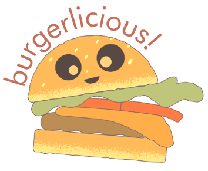

<h1 align="center" id="top"> 💁👨‍🍳 Burgerlicious </h1>

<p align="center">
    A web app to manage orders in a restaurant
    <br>
    ⚡ To access click <a href="https://burgerlicious-git-main-cbalieiro.vercel.app/">here</a>! ⚡
</p>

<p align="center">
 <a href="#-challenge">Challenge</a> •
 <a href="#-about">About</a> •
 <a href="#-development">Development</a> • 
 <a href="#-getting-started">Getting Started</a> • 
 <a href="#-build-with">Build With</a> • 
 <a href="#-authors">Authors</a>
</p>

##

Login for testing:

> 💁 **Hall** 
>
> Login - camilaoliveira@burgerlicious.com
> 
> Password - *burguinho*

> 👨‍🍳 **Kitchen**  
> 
> Login - biapenalva@burgerlicious.com
> 
> Password - *burguinho*

---

## 🎯 Challenge

The proposal was to develop an app to manage orders in a restaurant to a tablet interface, using React.JS and consuming the [API](https://lab-api-bq.herokuapp.com/api-docs/). The project was developed in groups of two people during four sprints of one week. To know more about the challenge click [here](https://github.com/Laboratoria/SAP005-burger-queen).

<p align="center">
    </img>
</p>

<p align="right">
  <a href="#top"> Back to the top. </a>
</p>

---

## 💡 About
Burgerlicious is a fast-food chain that works for 24 hours. Due to its success and expansion, the chain needs a system to improve the management of orders, making easy the communication between the employees in the hall and the kitchen. 

The interface must present two types of menu, breakfast and all-day, detailing the products. The waiter and waitress have to create the customer's order, view in real-time the summary with the final price to pay, then send it to the kitchen. In turn, the kitchen staff has to notify them when the orders are ready to be served. 

<p align="right">
  <a href="#top"> Back to the top. </a>
</p>

---

## 💻 Development

### 📋 Planning

This project was developed under demand, we receive four user's stories defined by the Product Owner. From that, we follow the Kanban model to [planning](https://trello.com/b/iATzyG7R/burgerlicious-%F0%9F%8D%94) and developing one user story per sprint. In total, we develop four stories in four sprints of one week. The strategy adopted to write the code was to make a code review.

##

### ⚙️ Features

##### 👨‍🍳 Sign up and sign in
- [x] Employees can sign up in the app giving their information: 
  - [x] name and last name
  - [x] e-mail
  - [x] password
  - [x] team-work
    - hall
    - kitchen
- [x] When the user is registered, she/he is redirected to the sign-in page
- [x] To sign in the users has to type their email and password, then they are redirected to the page that refers to their role 

##

##### 🍟 Create new order
- [x] The attendant can create new orders by giving this information:
  - [x] products and their respective quantity
  - [x] client name
  - [x] table number
- [x] User can filter the menu items by breakfast and burger
- [x] In the orders summary the user can:
    - [x] increase or decrease the product quantity
    - [x] delete a product
    - [x] see the order's final price while the products are added or taken from the bag
- [x] User can only send the order to the kitchen if all form fields have the necessary information

##

##### 📋 Manage orders
- [x] The kitchen employees can: 
  - [x] see the orders summary
  - [x] update the order status to doing and done
  - [x] access the orders history

##

### 🎨 User Interface

The color palette was developed in pastel colors, based on the burger anatomy:

<p align="center">
    </img>
  </img>
</p>

#### Logo

The chosen logo composes with the fun aesthetic that pastel tones bring to the brand and was developed by [Icons8](https://icons8.com/vector-creator/), made only a few changes by the authors.

<p align="center">
    </img>
</p>

#### Typography

It was used [Poppins](https://fonts.google.com/specimen/Poppins?) as the family font and the icons of [Material Design](https://material.io/) in the app. 

#### Prototype

The prototypes were developed prioritizing the tablet interface since was one of the requirements of the challenge. Besides that, we model [wireframes](https://www.figma.com/proto/VE1qAvPVorjSDtMrSbGmBr/BurguerIicious?node-id=27%3A3175&scaling=scale-down) and apply a usability test on this face to investigate how the *Create Order* feature could work in the best way. To see all the interface models click [here](https://www.figma.com/file/VE1qAvPVorjSDtMrSbGmBr/BurguerIicious?node-id=28%3A1381).

##### Low fidelity tablet prototype

<p align="center">
    </img>
    <br>
    🔎 Click on the image to enlarge 
</p>

##### High fidelity tablet prototype

<p align="center">
    </img>
    <br>
    🔎 Click on the image to enlarge 
</p>

##

### 🕵️‍♀️ Usability test

We apply usability tests using the low fidelity prototype and, then, as user's stories were concluded. The improvement points were:

&nbsp;
❌ The user missed knowing which form field was mandatory.

&nbsp;
✔️ Every form field has the title and the symbol * (known as a mandatory field) and the example of the info format.
##

&nbsp;
❌ The user did not understand the logout symbol used in the wireframe model.

&nbsp;
✔️ We change the icon and use also information in a text.
##

&nbsp;
❌ The user would like to change the product's quantity in the order summary to avoid having to come back in the menu section and save some clicks. 

&nbsp;
✔️ We put two buttons, minus and plus, to update the product quantity in the order summary.
##

&nbsp;
❌ The user would like to view which burger options were selected before adding in the order.

&nbsp;
✔️ We change the color of the items as they were selected.
##

&nbsp;
❌ The user missed receiving a message confirming that the order was sent successfully to the kitchen. 
 
&nbsp;
✔️ We add micro-interactions that send messages to the user when one action is canceled, concluded with success or unsuccessful.

##

### 🚧 Future implementations

- [ ] Notify in real-time hall and kitchen staff, without the need to refresh the page.
- [ ] Allow making comments about the order.
- [ ] Implement a self-attend service.

<p align="right">
  <a href="#top"> Back to the top. </a>
</p>

---

## 🚀 Getting Started

🔰 Before running the app, you need to have installed these tools on your computer: Git and Node.js.
```bash

# Fork the repository

# To clone this repository on your computer run:
$ git clone https://github.com/beatrizpenalva/burgerlicious.git

# To install the dependencies in your project's directory run:
$ npm install

# To execute the app on development  mode run:
$ npm run start

# The app will be open on port:3000 - access http://localhost:3000

```
##

👊 To contribute to this project:

```bash

# After installing the repository on your computer, create a new branch with your updates:
$ git checkout -b my-feature

# Save your changes
$ git add .

# Create a commit message telling what you did: 
$ git commit -m "feature: My new feature"

# Send your contribution to this repository
$ git push origin my-feature

```

<p align="right">
  <a href="#top"> Back to the top. </a>
</p>

---

## 👩‍💻 Build With

&nbsp;
🛠 JavaScript (ES6)

&nbsp;
🛠 HTML5

&nbsp;
🛠 [React.JS](https://reactjs.org/)

&nbsp;
🛠 CSS3

&nbsp;
🛠 [React-Bootstrap](https://react-bootstrap.github.io/)

<p align="right">
  <a href="#top"> Back to the top. </a>
</p>

---

## 🦸 Authors

<table align="center">
  <tr>
    <td align="center">
        <a href="https://www.linkedin.com/in/beatrizpenalva/">
            
            <br/>
            <sub> <b> Beatriz Penalva </b> </sub>
        </a>
        <br/>
        <a href="https://github.com/beatrizpenalva/" title="GitHub"> 👩‍💻 </a>
    </td>
    <td align="center">
        <a href="https://www.linkedin.com/in/camilabalieiro/">
            
             <br/>
             <sub> <b> Camila Oliveira </b> </sub>
        </a>
        <br/>
        <a href="https://github.com/cbalieiro" title="GitHub"> 👩‍💻 </a>
    </td>
  </tr>
</table>

<p align="center">
    Project developed in <a href="https://www.laboratoria.la/">Laboratoria</a> Bootcamp 💛
</p>

<p align="center">
  </img>
</p>

<p align="right">
  <a href="#top"> Back to the top. </a>
</p>
    
